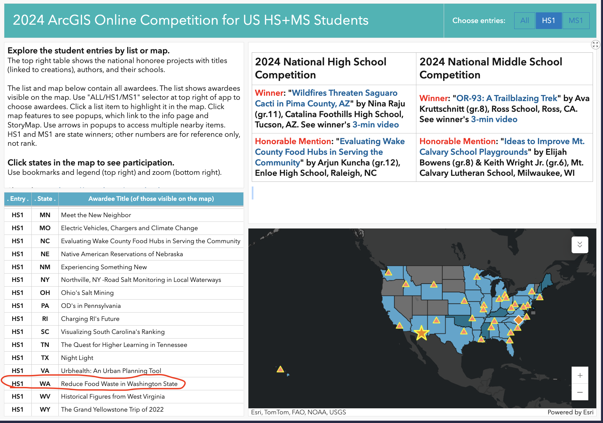
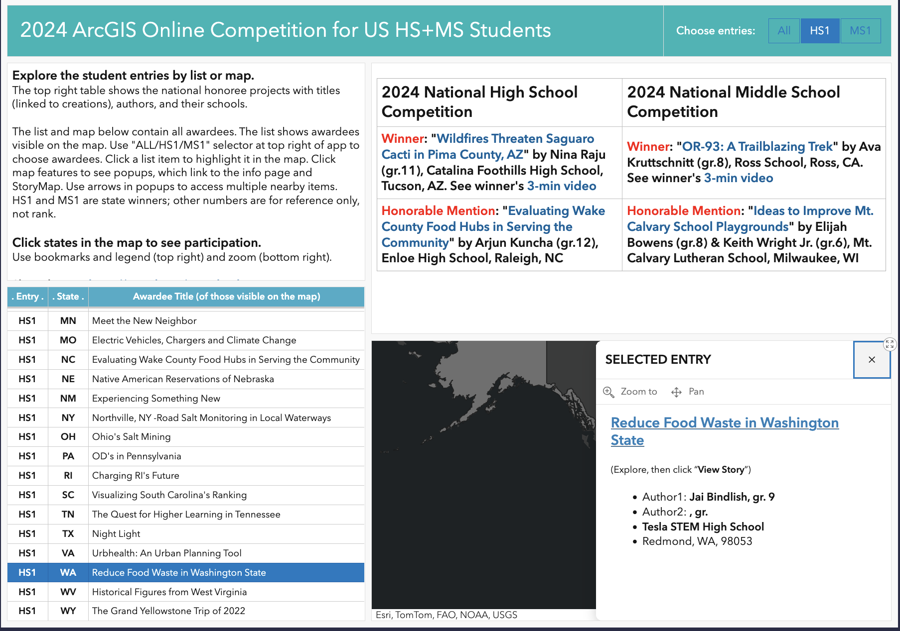

Hey everyone. Recently, I submitted a website storymap for the ArcGIS Storymapping Competition. 

TL,DR: ArcGIS Storymapping Competition – reserach a problem prevalent in your community and present in an effective way using the Storymapping website design software.

For my submission, I focused on the major issue affecting Washington State: food waste. With Dr. Wrenchey’s guidance (my entrepreneurship teacher), I developed a research report on food waste, demonstrating causes, descriptions, and solutions to the problem. Upon compiling data from many sources, I represented the problem using the unique storymapping feature of ArcGIS website design – creating powerful visuals. I submitted this project and received the award of HS1 – meaning I created the best research report out of all high schoolers in Washington that submitted. I also received a cash prize, which was sweet.
By creating this project and spotlighting the issue of Food Waste, I hope to increase community awareness and inspire potential solutions in my community. 

[Description of Competition](https://www.esri.com/en-us/c/industry/education/school-competition)
[My Created Website](https://storymaps.arcgis.com/stories/010d9cf654e5439b82e964d3568ea62e)
[Final Rankings](https://agoschoolcomp-education.hub.arcgis.com/?rsource=https%3A%2F%2Fesriurl.com%2Fagoschoolcomp)

